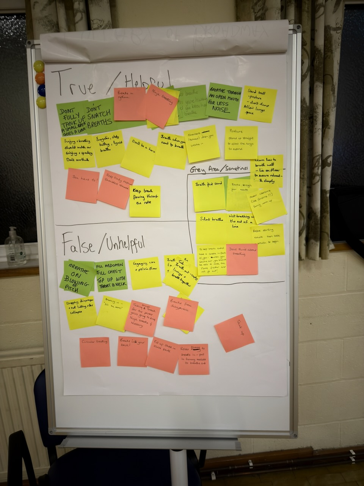

We had a pretty interesting idea at [Main Street Sound](https://mainstreetsound.co.uk) recently. Each month, we would dedicate a few minutes to a "Mini Workshop", in which we would dive into a particular topic we wouldn't usually get to cover in the normal course of rehearsal.

We devised the list of topics based on our members' 2026 New Years Resolutions; everyone was asked to write down something they wanted to learn more about with the chorus for 2026, and pop it in a box. Some really interesting themes emerged, and we wanted to try and get to at least the most popular ideas.

We had the first session this week, covering _breathing for singing_. Singers talk an awful lot about breathing, but I've come to learn over the years that we probably overthink it quite a lot. There's also some _very strange_ advice going around the barbershop world which, while well-intentioned, might cause more harm than good.

We ran the session in two halves. The first half involved splitting into groups and writing down as much of the breathing advice the singers could remember receiving over the years. We wanted them to include _everything_, whether they knew it to be helpful, unhelpful, or anywhere in between.

Once we'd compiled all the ideas, we came together to categorise then into "True/Helpful", "False/Unhelpful", or "Grey Area/Sometimes/Maybe/It Depends".

The result is in the photo below. I was pretty pleased with this outcome, but I'm keen to know if anyone has alternative opinions about where we've placed some of the ideas!

