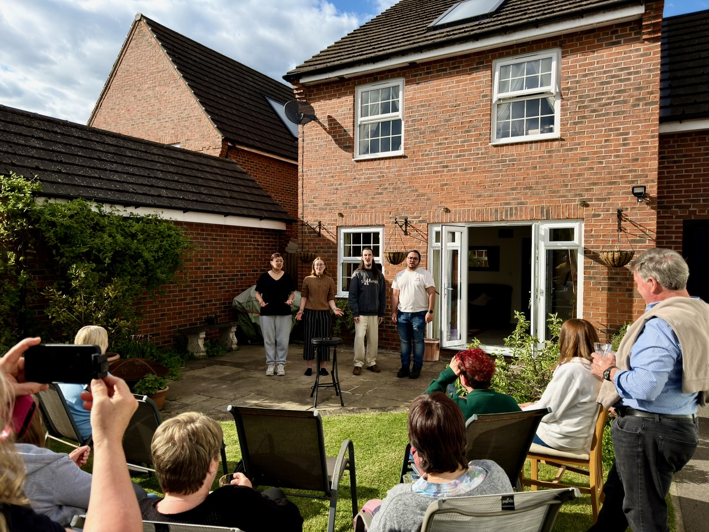

I had the pleasure of working with _Somewhat Original_ this weekend for the final stages of their preparation for the 2026 [BABS](https://singbarbershop.com) Youth Quartet Contest.

They've been around a little while and have a few contest appearances under their belts. They met at Durham University as members of _Full Score_ barbershop choir, and have kept singing together since graduation as a long-distance quartet.

It was a rare opportunity for me to be a group's first ever coach. Despite having sung together for a few years, they told me at the start of our day that they'd never had a coaching session before. This is a bit of a dream for a coach — something I think a lot about is making sure I don't tread on the toes of coaches who have gone before. But without that consideration, I was excited to come at this with a completely fresh slate.

The first thing to say is that this is a really great quartet. As individuals their singing skills are all excellent. So we spent much of the day talking about musicality, storytelling, and performance.

Barbershop judges talk a lot about identifying a song's "theme" (melody, rhythm, lyrics, comedy etc), and leaning into the primary theme as much as possible. They already had a pretty great idea for how they wanted to present their songs, and it was satisfying for me to be able to help bring that vision to life a bit more, with a few simple tweaks and fixes.

We had been hosted for the day by Caroline — mum of lead Rachel, and a member of my own chorus — and she had arranged for a little garden party for the neighbours as a sort of send-off/dry-run for the quartet. The neighbours, many of whom had not heard barbershop before, were suitably impressed.

Overall a great day — big thanks to the quartet for inviting me. Make sure you see them in the contest if you're going!

